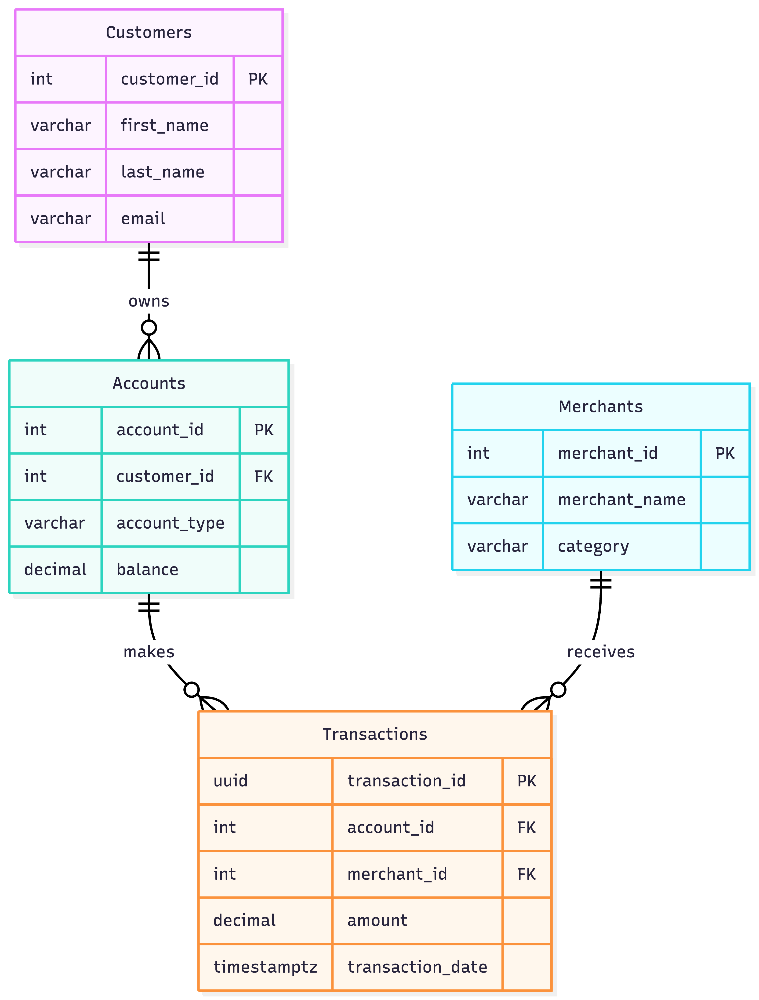

# 🏦 Fintech Data Warehouse & Analytics Engine

[](https://www.python.org/)
[](https://neon.tech/)
[](https://www.getdbt.com/)
[](https://streamlit.io/)
[](https://render.com/)

**Live Dashboard:** https://fintech-customer-dashboard.onrender.com  
**Video Demo:** *In progress (team upload pending)*

---

## 📌 Project Overview
This project is an end‑to‑end data engineering pipeline that ingests transactional and customer data, transforms it with dbt into a star‑schema warehouse, and serves it to a live Streamlit BI dashboard.

---

## 🏗️ Architecture & Tech Stack




**Core components:**
- **Data Ingestion:** Python scripts load raw source data into Neon.
- **Data Warehouse:** Neon (serverless PostgreSQL).
- **Transformations:** dbt builds staging (`stg_`) views and dimension/fact models.
- **Orchestration:** GitHub Actions runs dbt pipeline.
- **Presentation:** Streamlit dashboard with live SQL queries.
- **Deployment:** Render continuous deployment from GitHub.

---

## 📊 Dashboard Features
The Streamlit app includes:
1. **📇 Customer Directory** – searchable view from `dim_customers`.
2. **💰 Financial Overview** – time‑series and distribution charts from `fct_transactions`, with date filtering and KPIs.
3. **🚀 Advanced Analytics** – top LTV customers and aggregated metrics.

---

## 🖼️ Screenshots
Add 2–3 screenshots of the deployed app:


---

## ⚙️ Local Setup Instructions

### 1) Clone the repository
```bash
git clone https://github.com/Nayan2701/EAS550_FintechData.git
cd EAS550_FintechData
```

### 2) Install dependencies
```bash
pip install -r requirements.txt
```

### 3) Configure environment variables
Create a `.env` file at the project root:

```
DATABASE_URL=postgresql://[user]:[password]@[host]/[database]?sslmode=require
```

### 4) Run the Streamlit app
```bash
streamlit run app.py
```

---

## 🚀 Render Deployment (Continuous)
This app is **continuously deployed** to Render from this GitHub repo.  
Every push to `main` triggers an automatic build and deploy.

- **Live App:** https://fintech-customer-dashboard.onrender.com  
- **Secrets:** `DATABASE_URL` stored as Render environment variable (not in code)

> Note: Render free tier may cold‑start after inactivity (wait ~60 seconds).

---

## 🗄️ Repository Structure
- `app.py` — Streamlit UI & queries
- `models/` — dbt models (`stg_`, `dim_`, `fct_`)
- `dbt_project.yml` — dbt configuration
- `schema.sql` — database DDL
- `requirements.txt` — Python dependencies
- `.github/workflows/` — CI/CD automation

---

## 🔐 Security & Deployment Notes
- **No credentials are hardcoded** — all secrets are managed with environment variables.
- Render free tier may **cold‑start** after inactivity (wait ~60 seconds).

---

## ✅ Deliverables
- **GitHub Repo:** https://github.com/Nayan2701/EAS550_FintechData.git
- **Live App:** https://fintech-customer-dashboard.onrender.com
- **Demo Video:** https://youtu.be/LPZSHYRm3aE?si=vgR50ZCDMjE30zlk
